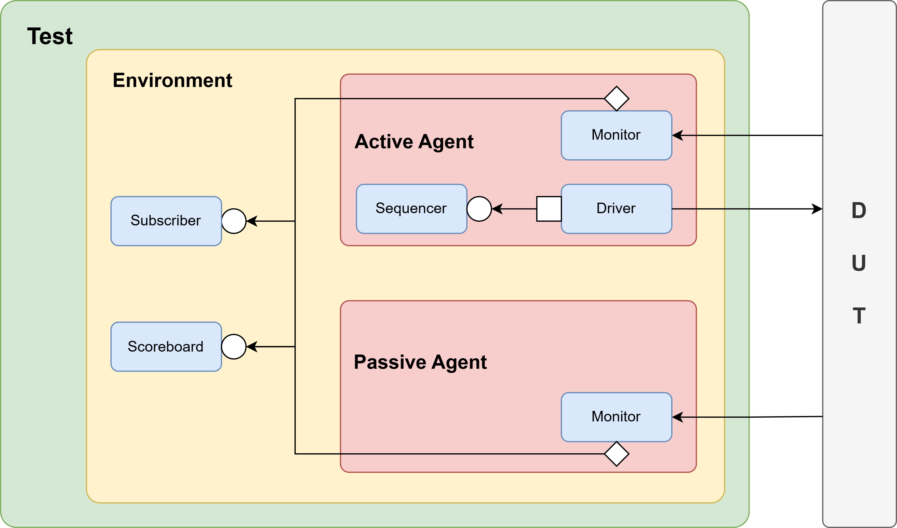

# Up-Down Counter Description

## 📘 Module Overview

This module implements a 3-bit up-down counter with direction control and edge-triggered reverse logic. It automatically changes direction when reaching predefined upper or lower bounds and also supports manual direction reversal through an input signal.

The counter starts from `0`, counts up to `7`, then down to `0`, and repeats this pattern continuously. If the `reverse` signal is asserted for one clock cycle, the current counting direction is toggled.

---

## 🔧 I/O Ports

| Port     | Direction | Width | Description                                      |
|----------|-----------|-------|--------------------------------------------------|
| `clk`    | Input     | 1     | Clock signal, rising-edge triggered              |
| `rst_n`  | Input     | 1     | Active-low asynchronous reset                    |
| `reverse`| Input     | 1     | Direction toggle signal (active for 1 cycle)     |
| `counter`| Output    | 3     | 3-bit counter value (range: 0 to 7)              |

---

## 🔁 Counter Behavior

- **Reset Behavior**:
  - When `rst_n` is deasserted (`0`), `counter` is reset to `0` and direction is set to up (`+1`).
  
- **Normal Operation**:
  - When counting **up**:
    - Increments by 1 every clock cycle.
    - Upon reaching value `7`, the direction automatically changes to **down**.
  - When counting **down**:
    - Decrements by 1 every clock cycle.
    - Upon reaching value `0`, the direction automatically changes to **up**.

- **Manual Direction Change**:
  - If the `reverse` signal is high (`1`) for **one clock cycle**, the current direction is flipped immediately.

---

### 📷 Counter Block Diagram



---

## Directory Structure
```
pkhuang_up_down_counter_vip/
├── design/
│   └── rtl.v
|
├── cov/
│   └── counter_coverage.sv
│
├── tb/
│   └── tb_top.sv
│
├── seq/
│   ├── rand_reverse_seq.sv
│   ├── always_reverse_seq.sv
│   └── never_reverse_seq.sv
│
├── src/
│   ├── counter_env.sv
│   ├── counter_agent.sv
│   ├── counter_driver.sv
│   ├── counter_monitor.sv
│   ├── counter_seq_item.sv
│   ├── counter_interface.sv
│   ├── counter_package.sv
│   └── counter_config.sv
│
├── scb/
│   └── counter_scoreboard.sv
│
└── test/
    ├── counter_test_base.sv
    ├── rand_reverse_test.sv
    ├── always_reverse_test.sv
    └── never_reverse_test.sv
```